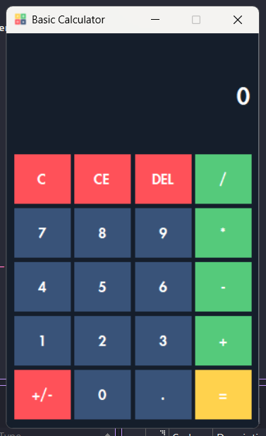
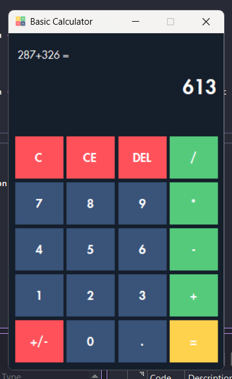
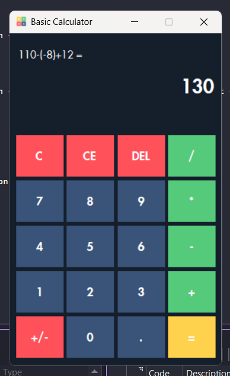
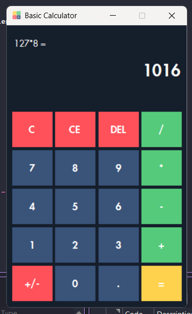
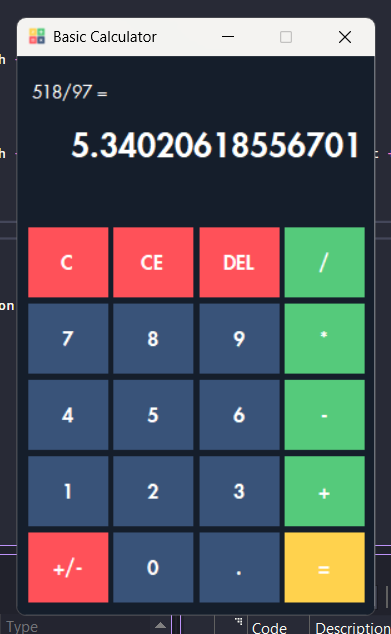

<p align="center">
  
</p>

## ⚡ About
**Basic Calculator** is a Windows Forms application built using C#. It allows users to perform basic arithmetic operations through a user-friendly interface. This calculator supports real-time expression building, sign switching, decimal inputs, and error handling—all while showcasing core object-oriented principles and event-driven programming.

## 📔 Table of Contents
- [Features](#features)
- [OOP Principles](#oop-principles)
- [How to Run](#how-to-run)
- [File Structure](#file-structure)
- [Screenshots](#screenshots)
- [Members](#members)
- [Acknowledgements](#acknowledgements)

## <a id="features">🔢 Features</a>
- Add, subtract, multiply, and divide
- Real-time expression building
- Delete individual characters
- Clear current or all input
- Sign change button (+/-)
- Decimal point support
- Error handling for invalid inputs and math errors
- Expression preview display

## <a id="oop-principles">⚖️ OOP Principles Used</a>

### 🔐 Encapsulation

✅ In This Project:
The Form1 class encapsulates calculator logic and UI state.
Fields like resultValue, expression, and justEvaluated are marked private, and their access is managed only through methods like Btn_equal_Click() and NumberButton_Click().

### 📁 Code Reference:
```

private double resultValue = 0;
private string operationPerformed = "";
private bool isOperationPerformed = false;
private string expression = "";
private bool justEvaluated = false;

```
These fields are modified using event handlers like:

### 📁 Code Reference:
```

private void NumberButton_Click(object sender, EventArgs e)
private void Btn_equal_Click(object sender, EventArgs e)

```

### 📦 Abstraction

✅ In This Project:
Button click behavior is abstracted through shared handler methods like NumberButton_Click and Operator_Click.
This hides the complexity of UI logic and makes the code easier to maintain.

### 📁 Code Reference:
```

btn_1.Click += NumberButton_Click;
btn_add.Click += Operator_Click;

```

This hides implementation detail and allows buttons to behave similarly with minimal repetition.

Also, display alignment logic is abstracted:

### 📁 Code Reference:
```

private void UpdateExpressionDisplay()

```

### 🧠 Event-Driven Logic

✅ In This Project:
All button click events are registered dynamically in RegisterEvents(), which makes the code scalable and centralized.

### 📁 Code Reference:
```
private void RegisterEvents()
{
    btn_0.Click += NumberButton_Click;
    // ...
    btn_add.Click += Operator_Click;
    // ...
}

```

This improves maintainability and scalability, making it easy to manage or extend event behavior from one place.


## <a id="how-to-run">⚙️ How to Run</a>

1. Clone or download the repository.
2. Open the `.sln` file in Visual Studio.
3. Ensure all resources and image files are present in the project.
4. Build and run the application.
5. Use the calculator with your mouse or keyboard (if extended).

## <a id="file-structure">📁 File Structure</a>

```
├── CalculatorAppLab4
    └── bin/Debug/                 # Output folder (created after build)
        └── CalculatorAppLab4.exe  # Executable after building
    ├── obj
    ├── Properties
    ├── App.config
    ├── CalculatorAppLab4.csproj   # Project file
    ├── Form1.cs                   # Contains full calculator logic and event handling
    ├── Form1.Designer.cs          # Auto-generated layout file
    ├── Form1.resx                 # Designer resources
    ├── Program.cs                 # Application entry point
├── images
├── .gitignore
├── CalculatorAppLab4.sln          # Visual Studio solution file
├── README.md
```

---

## <a id="screenshots">📸 Screenshots</a>

<p align="center">
  
</p>

<p align="center">
  
</p>

<p align="center">
  
</p>

<p align="center">
  
</p>

<p align="center">
  
</p>

<p align="center">
  
</p>

<p align="center">
  
</p>

## <a id="members">👥 Group Members</a>

| Name | SR-Code | 
|------|---------|
| [Calog, Chester King](https://github.com/ChesterCalog) | 23-09045 |   
| [Donayre, Aila Roshiele](https://github.com/ailadonayre) | 23-02175 |  
| [Villanueva, Daniel](https://github.com/danielbvillanueva) | 23-01037 | 
| [Tarcelo, Mark Niño](https://github.com/ElgatoMe0w) | 20-08675 | 

## <a id="acknowledgements">💎 Acknowledgements</a>
Special thanks to our instructor, **Ms. Fatima Marie Agdon**, for guiding us through event-driven programming and WinForms development. This project enhanced our understanding of C# and GUI applications.
